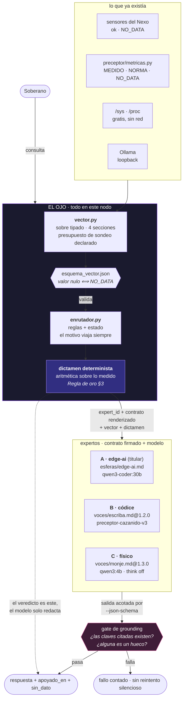

# ADR · El Ojo del Soberano: vector de estado y enrutador MoE local

- **Fecha:** 2026-09-06
- **Estado:** aceptado · Fases 1 y 2 implementadas y con gate
- **Nodo:** `soberano` · todo local, cero nube en el camino de la consulta
- **Artefactos:** `Alejandria/ojo/{esquema_vector.json, vector.py, enrutador.py, vector_ejemplo.json}`

---

## 1 · El problema

El Ojo ya era el nexo de arranque de toda sesión de IA en este nodo, pero lo que entregaba era
**prosa para una IA que lee**. Una máquina no puede validar prosa, y un modelo local al que se le
cuenta el rack en párrafos rellena los huecos con lo que le suena.

Hacía falta lo otro: un objeto **tipado y validado** que se inyecte como `[SYSTEM CONTEXT]` antes
del prompt, y una capa que decida **quién** contesta con ese contexto delante.

## 2 · La decisión

Tres piezas, y la primera es una resta.

### 2.1 · No se escribió un stack de sensores. Ya había tres

En el repo convivían tres implementaciones de «una lectura con su procedencia»:

| Fuente | Estados que distingue | Qué mide |
|---|---|---|
| `hexelion-nexo/sensores/` | `ok` · `NO_DATA` | diez sensores del rack |
| `preceptor/metricas.py` | `MEDIDO` · `NORMA` · `NO_DATA` | el metal local y el vatímetro |
| `Alejandria/ojo/ojo.py` | `OK` · `NO_DATA` | lo que el panel sirve |

Una cuarta habría sido una cuarta verdad sobre los mismos hechos — el fallo contra el que avisan por
escrito `jardin.py`, `soberania.py` y la cabecera del propio `ojo.py`. **`vector.py` es el sobre que
las adapta**, con los adaptadores juntos en un sitio (`de_metricas`, `de_nexo`).

### 2.2 · Cuatro estados, y la invariante la hace cumplir el esquema

`MEDIDO` sale del kernel o de un aparato · `NORMA` lo declara alguien y nadie lo ha medido ·
`NO_DATA` es el hueco con su causa · `STALE` es lo que fue bueno y ya no.

La regla que lo sostiene todo — **valor nulo si y solo si `NO_DATA`** — no depende de la buena
voluntad de quien escriba: la impone el JSON Schema, en las dos direcciones. Un cero decorativo es
indistinguible de una medida, y aquí no cabe escribirlo aunque se quiera.

### 2.3 · El enrutador lee contratos, no lleva prompts

Los tres expertos ya existían firmados en `mente/`. La Orquesta §2.2 obliga a consumir **MDs
renderizados (`md_id@version`)** y a abortar si la versión no cuadra, así que `enrutador.py` no
contiene ni una línea de personalidad: la lee del disco y comprueba su ancla.

## 3 · El flujo

## 4 · Lo que solo se supo midiendo

Cinco hechos que cambiaron el diseño. Ninguno se dedujo.

1. **Pydantic no está instalado** en este nodo, ni FastAPI; sí `jsonschema 4.19.2` y `psutil`. El
   esquema es JSON Schema 2020-12 + `dataclasses`, y **el mismo fichero alimenta dos consumidores**:
   la validación local y el campo `format` de Ollama.
2. **La salida acotada por esquema ya funciona**: Ollama 0.33.2 honra `format`, comprobado en vivo.
   No hace falta `llama-server --json-schema`.
3. **La única cifra física que no sale de `/sys` ni `/proc` es el vatímetro.** Mide **consumo**, no
   generación. `generacion_solar_w` es `NO_DATA` con causa, y hay un test que impide conectarlo al
   enchufe.
4. **El sobre del Alfabeto cuesta 879 tokens frente a 3.468 de la prosa JSON** — 74,7 % menos,
   contado con el tokenizador local, no estimado en bytes. Muy por encima del ≥30 % que exige el
   Alfabeto §6. El A/B vive en `mente/telemetria/lengua.jsonl`.
5. **`backend` estaba midiendo la propiedad equivocada**: devolvía `details.family` (`"llama"`), la
   familia del modelo, no dónde corre. Ahora sale del reparto `size_vram`/`size`. Un `MEDIDO` que no
   mide lo que dice medir es peor que un hueco, porque nadie vuelve a mirarlo.

## 5 · Anclar la cita no ancla el razonamiento

Es la lección más cara de la Fase 2, y llegó en tres pasos:

1. El Monje contestaba citando `/api/health/nodes` y `hexelion:telemetry:m5:last` — claves de **su**
   lista blanca, que sirve La Torre y este nodo no tiene. → La lista blanca se sustituye en el
   **render** por la del turno. El artefacto en disco no se toca, y la sustitución se declara.
2. Seguía inventando `/api/health/models`, `/api/health/repos`. La causa estaba en los **few-shot**
   de la ZONA EVOLUTIVA, que citan esas claves: **un ejemplo pesa más que una regla**. Se retiran del
   render; el arquetipo y el tono se quedan. Y el contrato del turno pasa a llevar el **catálogo de
   rutas** con su estado: no se puede exigir que cite de una lista que nunca vio.
3. Con eso, `qwen3:4b` (`think:false`) cita las cinco claves del dictamen y pasa el gate — pero
   **razona mal sobre ellas**: concluye que 59,2 W «no dan energía suficiente para un entrenamiento».
   El número es real; la inferencia es inventada.

> **Por eso el veredicto es el dictamen determinista y el modelo solo redacta.** El gate de grounding
> demuestra que el modelo *tocó* datos reales. No demuestra que la conclusión se siga de ellos.

## 6 · Alternativas descartadas

| Alternativa | Por qué no |
|---|---|
| Pydantic v2 para el esquema | No está instalado y no hay sudo interactivo. JSON Schema además sirve para el `format` de Ollama; Pydantic habría necesitado una exportación aparte. |
| Un clasificador ligero para elegir experto | Una caja que no se puede auditar cuando se equivoca. Las reglas + estado explican la elección con una frase, y esa frase viaja en la respuesta. |
| Sensores nuevos para CO2, humedad y solar | Sería cablear hardware desde un panel. Lo que falta se declara `NO_DATA` con su remedio; el colector, si se quiere, sale **propose-only** a `p0x/propuestas/`. |
| Sondear los otros nodos por SSH | *«Una ventana que entra por SSH en cuatro máquinas cada treinta segundos no es una ventana, es un agente con llaves.»* Se usa el sensor `nodos` del Nexo. |
| Consultar GitHub al construir el vector | Una sonda a la nube en el arranque de cada consulta, en un sistema que existe para no depender de ella. Va por caché con fecha, y `STALE` a las 24 h. |

## 7 · Consecuencias

**Lo que se gana.** Un contexto que no puede mentir por forma; una elección de experto auditable;
una salida acotada y comprobada contra el estado real; y un coste conocido — ~100 ms y 5 sondas
declaradas para construir el vector, 879 tokens para inyectarlo.

**Lo que se paga.** El vector es un acoplamiento nuevo entre el Ojo, el Nexo y `preceptor/metricas.py`:
si una de esas fuentes cambia de forma, se arregla un adaptador — pero hay que enterarse. El gate lo
cubre con `vector_ejemplo.json`, que se valida en cada ejecución.

**Lo que sigue sin poder responderse, y ahora se dice en voz alta:** mientras nadie mida la
generación solar, la regla «si solar > consumo, lanza tarea pesada» **no es evaluable**. Quien la
aplique estará estimando.

## 8 · Deuda declarada

- **`NORMA` no tiene palabra en el léxico del Alfabeto §2** (`ok`, `sin_dato`, `stale`, `degradado`,
  `caido`). Se traduce a `ok` conservando `norma: true`. Un ID nuevo entra por la ZONA EVOLUTIVA y lo
  firma el carbono: queda **propuesto, no aplicado**.
- **El gateway de La Fragua no contesta**, así que ADS-B y las sondas profundas de nodo salen
  `NO_DATA`. Es dato correcto, no avería del vector.
- **ESP32 y cámara** entran como **ausencia declarada** (retirados, pendientes de reconexión), que no
  es lo mismo que un sensor que falla.
- **El experto A nunca se ha ejecutado**: `qwen3-coder:30b` son 18,6 GB y cargarlo cuesta minutos de
  pared. El enrutador lo avisa antes de elegirlo; medir su turno completo queda pendiente.
