# Architecture

A read-only window over a four-node home rack. One Python process, no
dependencies, no cloud, no build step.

The interesting decisions are all refusals: what this does *not* do is what
makes the numbers work.

---

## 1 · The data path

```mermaid
graph LR
  subgraph rack["THE RACK · Tailscale mesh, WireGuard-encrypted"]
    direction TB
    SOB["soberano<br/>mini PC · 64 GB"]
    FRA["la-fragua<br/>ARM SBC · NVMe"]
    VIG["el-vigia<br/>SBC · SDR"]
    TOR["la-torre<br/>GPU module"]
  end

  subgraph proc["EL NEXO · one Python process, no dependencies"]
    direction TB
    SEN(["sensores/<br/>one module per source"])
    VIG2(["vigia.py<br/>ONE refresher thread"])
    FRG(["fragmentos.py<br/>reading → HTML section"])
    SRV(["servidor.py<br/>http.server · GET and HEAD only"])
  end

  BRW["browser<br/>11 KiB · 0 dependencies"]

  SOB -. "systemctl show · disk · version" .-> SEN
  FRA -- "HTTP · node and antenna probes" --> SEN
  VIG -. "measured through la-fragua" .-> FRA
  TOR -. "measured through la-fragua" .-> FRA
  SOB == "tailscale status --json<br/>resolved locally, asks no one" ==> SEN

  SEN -- "reading, or a gap with a cause" --> VIG2
  VIG2 -- "every 30 s · one read for all viewers" --> FRG
  FRG -- "escaping happens once, here" --> SRV
  SRV == "SSE · data: is HTML, never JSON<br/>only changed sections" ==> BRW
  BRW -. "EventSource · native, auto-reconnect<br/>innerHTML = ev.data · decides nothing" .-> BRW

  classDef metal fill:#0C120F,stroke:#3DF58F,stroke-width:1px,color:#DCE8E1
  classDef soft fill:#0A100D,stroke:#7AA2FF,stroke-width:1px,color:#9DB0A6
  classDef cara fill:#0C2018,stroke:#3DF58F,stroke-width:2px,color:#3DF58F
  classDef critico fill:#0C120F,stroke:#FF4D4D,stroke-width:1px,color:#DCE8E1
  class SOB,FRA,TOR metal
  class VIG critico
  class SEN,VIG2,FRG,SRV soft
  class BRW cara
```

Rectangles are metal. Rounded boxes are processes. Solid arrows are
measurements taken; dotted arrows are measurements taken *through* something
else. `el-vigia` is outlined in red because it is, right now, partially down —
see §2.

The chain in one line: **sensors read → one thread composes HTML → SSE pushes
only what changed → the browser places a string.**

### One reader, many watchers

The naive design reads sensors per request. With N tabs open, that is N
conversations with systemd, the disk and the tailnet every thirty seconds — the
cost grows with the audience, and an audience should cost nothing.

Here a single thread refreshes and leaves the snapshot **already composed as
HTML**. Open streams wait on a `threading.Condition` for the version counter to
rise, then receive the sections that changed. Opening one more tab costs a
socket, not a round of probes.

It also answers the "don't block the event loop" requirement from the other
side: when the rack sensor spends four seconds against the tailnet, the one
waiting is the refresher, never a viewer.

### The server emits HTML

`data:` carries a finished `<section>` — header, chip and body. Three things
follow:

- The browser parses nothing and decides nothing. It places a string.
- **Escaping happens once**, in Python, on raw data — not spread across seven
  client-side painters, which is where you eventually forget one.
- The "no data → NO_DATA with a cause" rule stops being written in two
  languages.

Only changed sections are pushed. With six cards quiet and one live, that is
386 bytes instead of 8 KB.

---

## 2 · Honest Sensors

The rule: **with no data you say there is no data, with its cause.** Never a
decorative zero, never a frozen screen, never a plausible guess.

It is easy to state and easy to violate. Three cases from this codebase, all
found by measuring rather than reading:

**A missing probe is not a sleeping node.** The panel once marked a node
`EN ESPERA` when the gateway's deep probe did not arrive. But a silent gateway
says nothing about whether a node is asleep — it says *we do not know*. The node
answers on the tailnet, so it is up; what is missing is the probe. It now reads
`ONLINE` with `inference NO_DATA`, and a warning names which nodes lack probes.

**systemd answers `Result=success` for a service that never started.** It is a
default, not a measurement. A timer armed for days and never fired would have
rendered green, identical to one that just finished cleanly. When there is no
last run, the result is `NO_DATA` too.

**A dead service is not absent hardware — and a precise diagnosis can still
name the wrong machine.** The AIS chain is down. The convenient label was "SDR
disconnected": false, since ADS-B receives through that same radio with
sub-second message ages. The second answer — "the AIS service is down on this
node" — was precise and still wrong: the chain had moved, and the gateway's
probe was still aimed at its old home. The panel now reports *where the probe is
looking*, the only thing it actually knows, and warns when that is not the node
on the card. A red that names the wrong host sends you to repair what is not
broken.

A test enforces the last one generally: no node may report `CRITICO` without
carrying an alert string.

### Degrading honestly

When the stream stops, the page does **not** blank. What was measured is still
true of when it was measured. But it stops presenting itself as alive: the whole
document loses colour and the header states how long since the last heartbeat.
A frozen interface showing old figures is worse than an empty one, because it
looks like it works.

The heartbeat exists for the same reason. A live connection that says nothing is
indistinguishable from a dead one; only the clock separates them.

---

## 3 · Why there is no framework

React, Vue, Angular, htmx and Alpine are all absent — not vendored, not from a
CDN. A test greps all three front-end files for each name.

Reactivity comes from `EventSource`, which ships with the browser: zero bytes
downloaded, zero dependencies to audit, and automatic reconnection nobody has to
write. Open/close state uses `
`, which the browser already knows how to
do — with keyboard and screen reader support, for free.

The htmx-shaped alternative was considered and declined on its own metric:
htmx minified is roughly 14 KB, and it renders nothing on its own. **This entire front end — ten live cards, a topology map and an MJPEG feed — is 14 KB.**

---

## 4 · Key metrics

| | | |
|---|---|---|
| Front end, total download | **14 KiB** | HTML + CSS + JS · ten cards, still under minified htmx + Alpine |
| Client JavaScript | **51 lines** | it places strings; it computes nothing |
| Server resident memory | **29 MB RSS** | empty CPython on this machine is already 9.7 |
| Runtime dependencies | **0** | none vendored, none fetched |
| Update path | **push, not poll** | SSE · the browser never asks |
| Bytes per quiet update | **~386 B** | only changed sections travel |
| Sensor reads per viewer | **0** | one refresher serves every open tab |
| Tests | **126** | two suites, one runner · 20 of them chaos |
| Build step | **none** | clone, `python3 servidor.py` |

On latency: updates are pushed the moment the refresher notices a change, so the
wire adds nothing. What bounds freshness is the **30 s refresh cadence**, chosen
deliberately — sensors talk to systemd, the disk and the network, and a panel
that asks every second stops being a window and becomes load. The cadence is one
constant (`vigia.CADA`); the transport has no floor.

On the 29 MB: an empty CPython interpreter on this machine is already 9.7 MB.
A 10 MB target is not reachable in this runtime, and saying so is cheaper than
rounding toward the number that was asked for.

---

## 5 · The surface, and what it refuses

- **Read-only.** No POST, PUT, DELETE or PATCH. A test asserts all four are
  rejected. A panel that can turn things off is a command surface, and a command
  surface needs a conversation about who can reach it.
- **No SSH.** Remote state comes from an HTTP API the rack already publishes. A
  window that opens SSH sessions into four machines every thirty seconds is not
  a window; it is an agent holding keys.
- **Binds to loopback**, with a test pinning it, so reaching the network cannot
  happen by accident.
- **One switch for the one sensor that leaves the machine.** `--sin-red` makes
  the rack sensor return a declared gap instead of touching the network. The
  rest of the panel is unaffected, because the rest never left.
- **Routes are an allow-list**, not `getattr` on the path. With `getattr` every
  module attribute becomes reachable from outside, and that is not an API.

---

## 6 · Configuration lives on the machine

No address, hostname or rack layout is in the source. Machine names go in
`.env` and `estado/rack.conf`, both ignored by git, both with a versioned
`.example`. What enters a repository's history cannot be removed without
rewriting it.

Absence is never an error: with nothing configured the panel still starts, and
the cards that depend on what is missing say `NO_DATA` with a cause. **With no
rack file, no rack is invented** — a panel filled with example nodes is worse
than an empty one, because the emptiness is visible and the example is mistaken
for data.

`bin/sanitize_for_public.sh` gates this. It audits and refuses; it does not
rewrite. A sanitiser that substitutes leaves the job half done when it fails
half way, and the worst thing about `sed` over source is that it almost always
works — until the day it breaks a line and nobody reads the diff, because "the
script fixed it". The copy comes from `git archive HEAD`, so anything untracked
cannot come along.

It earned its keep on first run: it caught three tests that only passed because
the core tree happened to be a neighbour on this machine.

---

## 7 · Chaos

`test_caos.py` breaks things on purpose. The question it answers is not "does it
survive?" but **"what does it show while it doesn't?"** — a panel that survives a
node going down by painting the last known value has survived *and lied*, and
lying is the one failure this tree cannot recover from: if the panel can invent
once, it can never be believed again.

Twenty cases, no network needed — failures are simulated with `unittest.mock`,
which is how you test a fault without causing one:

| | |
|---|---|
| A node drops | `OFFLINE`, and **not** its last known value |
| A node the tailnet never names | `NO_DATA` — not knowing and knowing-it-is-down are different claims |
| The gateway dies | the other three cards survive; the source string stops citing what no longer speaks |
| A radio chain dies | `CRITICO` with a measured cause, and a case that **forbids** asserting missing hardware |
| Any sensor raises | declared gap with a cause, never an exception |
| Every gap, everywhere | must carry a cause — and "unknown", "n/a" and "error" are rejected as non-causes |
| Mechanism latency | a change publishes in under 2 s of the refresher seeing it; a waiter wakes without polling |

Three things it deliberately does **not** assert: a two-second detection budget
(the 30 s cadence is a choice, and confusing cadence with latency would make a
test that proves nothing), a specific "hardware absent" label (a diagnosis, not
a measurement — and false here), or exact wording in the interface.
